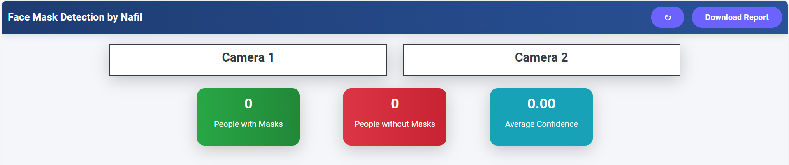

# Face Mask Detector using Deep Learning and Flask Web Application



## Table of Contents
- [Introduction](#introduction)
- [Features](#features)
- [Technologies Used](#technologies-used)
- [Installation](#installation)
- [Usage](#usage)
- [Contributing](#contributing)
- [License](#license)

## Introduction
The Face Mask Detector is a web application developed using Flask and deep learning techniques to detect whether individuals are wearing face masks in real-time. This project aims to contribute to public health safety by promoting the use of face masks in crowded areas.

## Features
- Real-time face mask detection using deep learning models.
- User-friendly web interface.
- Displays statistics on mask usage.
- Supports multiple camera feeds.

## Technologies Used
- Python
- Flask
- TensorFlow / Keras
- OpenCV
- HTML/CSS/JavaScript
- Git
- GitHub

## Installation
To set up the project locally, follow these steps:

1. Clone the repository:
   ```bash
   git clone https://github.com/inafilahamed/face-mask-detector-using-deep-learning-and-flask-web-application.git
   cd face-mask-detector-using-deep-learning-and-flask-web-application
